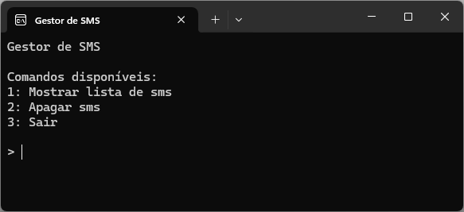
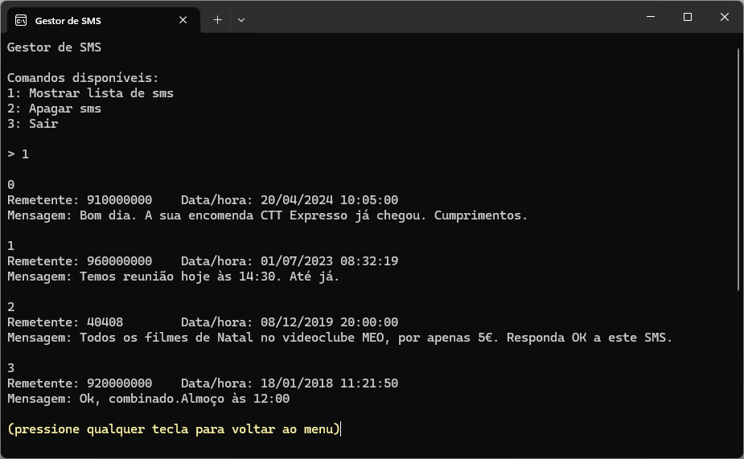
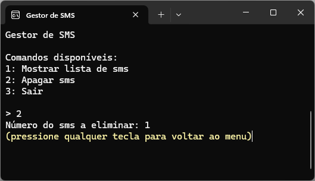

# Ficha de Trabalho: Gestor SMS

Nesta ficha de trabalho irá utilizar o projeto Visual Studio disponibilizado neste repositório, de modo a completar um programa para armazenar mensagens de texto de telemóvel (sms). Para efeito deverá utilizar uma estrutura do tipo ```List<>```.

Para cada sms é necessário armazenar a seguinte informação:

- o número de telefone do remetente
- a data e hora de receção da mensagem
- a mensagem propriamente dita
- a indicação de que a mensagem foi lida ou não lida

## Funcionamento da aplicação

Deve ser mostrado um menu com as seguintes opções:



1. **Mostrar lista**: mostra todos os sms armazenados na lista
2. **Apagar Sms**: apagar um sms específico
3. **Sair**: terminar a aplicação

## Resolução

Crie uma ```struct``` para armazenar os dados dos sms.
Declare uma estrutura do tipo ```List<>``` para armazenar uma lista de mensagens.

## Dados a inserir

A lista deve ser inicializada com os seguintes dados (nesta ordem):

|Remetente|Data/Hora|Mensagem|
|---|---|---|
|910000000|20/04/2024<br>10:05:00|Bom dia. A sua encomenda CTT Expresso já chegou. Cumprimentos.|
|960000000|01/07/2023<br>08:32:19|Temos reunião hoje às 14:30. Até já.|
|40408|08/12/2019<br>20:00:00|Todos os filmes de Natal no videoclube MEO, por apenas 5€. Responda OK a este SMS.|
|920000000|18/01/2018<br>11:21:50|Ok, combinado. Almoço às 12:00|

## Etapas necessárias para a resolução

1. Criar a ```struct Sms``` com os respetivos campos
2. A ```struct Sms``` deverá ter um construtor que inicializa os campos
    - Atenção que o campo que indica se o sms foi lido é inicializado pelo construtor com o valor ```false```
3. Criar a lista que armazena os sms
4. Inserir mensagens na lista
5. Completar o código para implementar as seguintes operações:
    - Mostrar todos os sms armazenados na lista
    - Apagar um sms específico



